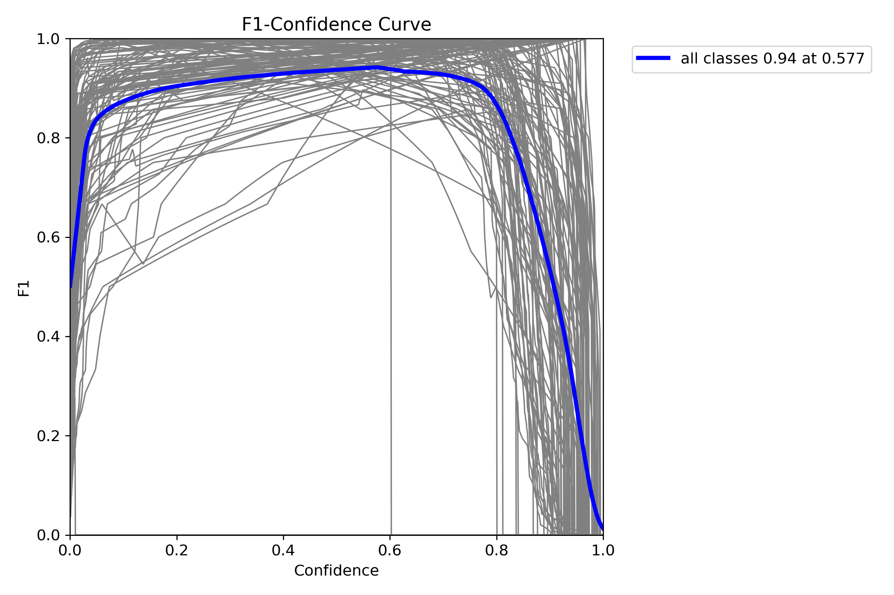

# Bengali_License_Plate_Recognition
Full YOLOv8 based Bangladeshi Vehicle License Plate Recognition.

## Demo
[![Watch the video demonstration]](https://drive.google.com/file/d/1H8pPJruDS8Gm2Uxu-_MeRnzxKP7c8qVX/view?usp=drive_link)

  
   
  <em>demo.gif</em>

## Overview

This project aims to achieve real-time license plate detection and is designed for implementation on NVIDIA Jetson platforms. 

The pipeline integrates two specialized models: one for license plate detection and another for character recognition from the extracted license plate.

This Bangla LPDB - A dataset is of two parts-

1. Bangladeshi vehicle images with visible Bangla license plates which includes 1928 images.

2. Cropped Bangla license plate which includes 2662 images (720 synthetic images, 1942 images manually cropped from part-1).

 

Each image also contains its corresponding annotated text file in YOLO format. For Part-1 and Part-2, number of classes are 1 and 102, respectively.

Dataset link: [Bangla LPDB-A](https://zenodo.org/records/4718238)

## Training and Validation
### Detection Model
| Confusion Matrix | F1 Curve | Validation-Labels | Validation-Predictions |
|:----------------:|:--------:|:----------------:|:---------------:|
|  |  |  |  |

### OCR Model
| Confusion Matrix | F1 Curve | Validation-Labels | Validation-Predictions |
|:----------------:|:--------:|:----------------:|:---------------:|
|  |  |  |  |

## Project Structure 
Folders: 
model-m-detection : YoloV8-m model for detection. 
model-m-ocr : YoloV8-m model for OCR 

same goes for all the models. 

sample-images/videos for demonstration  

.ipynb files are pretty much self explanatory. 

dataset-process-detection/ocr.ipynb files for transforming the raw dataset into Yolo specific folder structure. 

model-training.ipynb : Training for YoloV8-n/s/m 

detection/ocr-inference.ipynb : Doing inference on sample-images. 

real-time-inference.ipynb : Inference on recorded video file .mp4 .

## Citation

@dataset{ataher_sams_2021_4718238,
  author       = {Ataher Sams and
                  Homaira Huda Shomee},
  title        = {Bangla LPDB - A},
  month        = apr,
  year         = 2021,
  publisher    = {Zenodo},
  version      = {v1},
  doi          = {10.5281/zenodo.4718238},
  url          = {https://doi.org/10.5281/zenodo.4718238},
}
