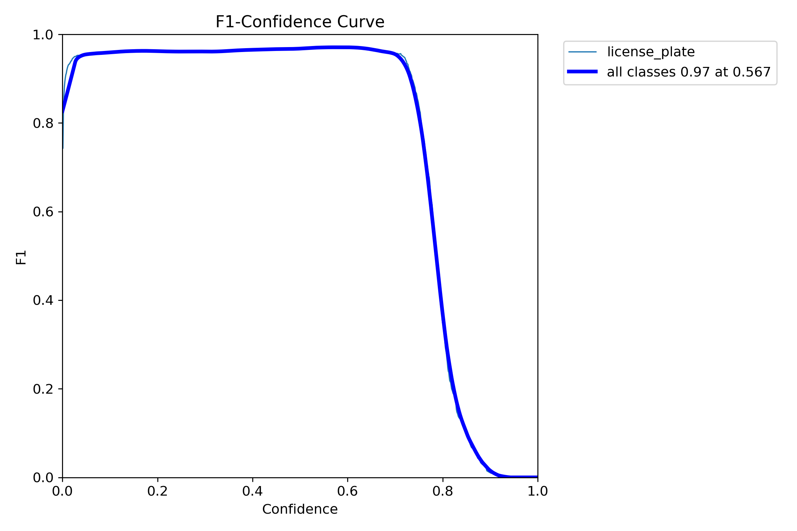
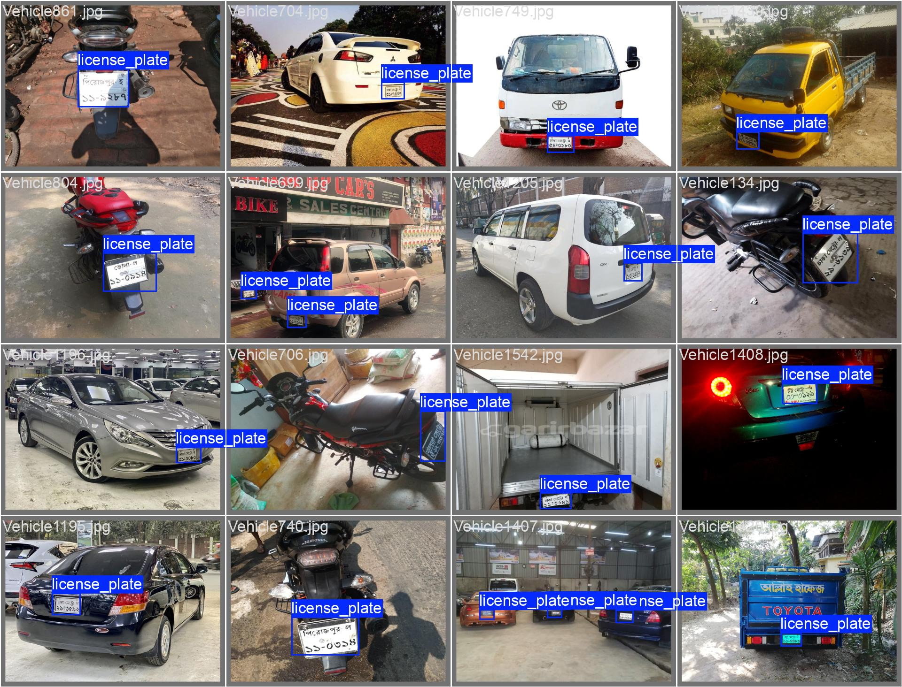

# Bengali_License_Plate_Recognition
Full YOLO based Bangladeshi Vehicle License Plate Recognition.

## Overview

This project aims to achieve real-time license plate detection and is designed for implementation on NVIDIA Jetson platforms. 

The pipeline integrates two specialized models: one for license plate detection and another for character recognition from the extracted license plate.

This Bangla LPDB - A dataset is of two parts-

1. Bangladeshi vehicle images with visible Bangla license plates which includes 1928 images.

2. Cropped Bangla license plate which includes 2662 images (720 synthetic images, 1942 images manually cropped from part-1).

 

Each image also contains its corresponding annotated text file in YOLO format. For Part-1 and Part-2, number of classes are 1 and 102, respectively.

Dataset link: [Bangla LPDB-A](https://zenodo.org/records/4718238)

## Training and Validation

| Confusion Matrix | F1 Curve | Validation-Labels | Validation-Predictions |
|:----------------:|:--------:|:----------------:|:---------------:|
|  |  |  |  |